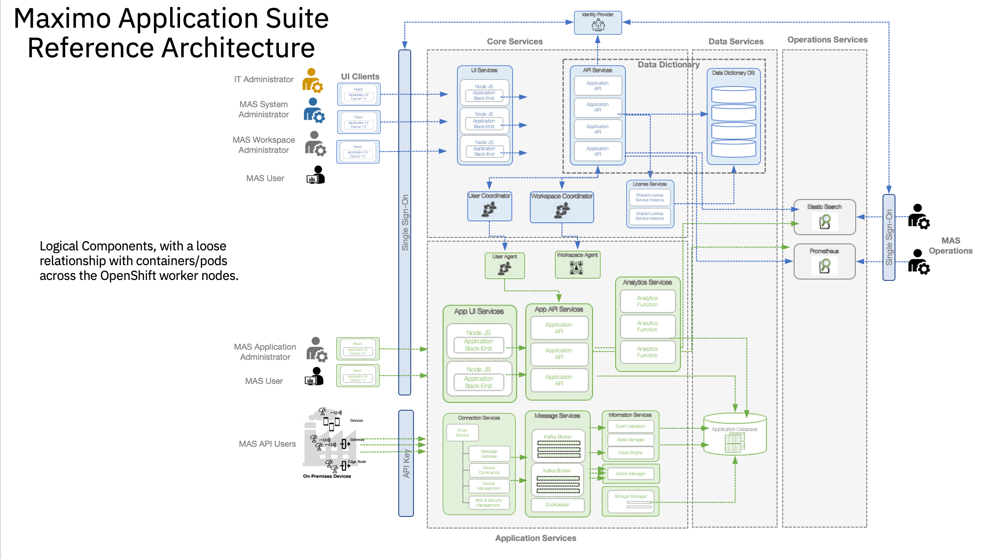

# Maximo Application Suite - Core Automation for AWS, Azure, and IBM Cloud

## Overview

> This collection of Maximo Core IBM Cloud terraform automation layers has been crafted from a set of  [Terraform modules](https://modules.cloudnativetoolkit.dev/) created by the IBM GSI Ecosystem Lab team part of the [IBM Partner Ecosystem organization](https://www.ibm.com/partnerworld/public?mhsrc=ibmsearch_a&mhq=partnerworld). Please contact **Matthew Perrins** _mjperrin@us.ibm.com_, **Sean Sundberg** _seansund@us.ibm.com_, **Tom Skill** _tskill@us.ibm.com_,  or **Andrew Trice** _amtrice@us.ibm.com_ for more details or raise an issue on the repository.

The automation will support the installation of Maximo Core on three cloud platforms (AWS, Azure, and IBM Cloud).

### Releases

## Target Infrastructure

The Maximo Core automation assumes you have an OpenShift cluster already configured on your cloud of choice. The supported OpenShift options are [ROSA for AWS](https://aws.amazon.com/rosa/), [ROKS for IBM Cloud ](https://www.ibm.com/cloud/openshift) or OpenShift IPI instances.

Before you start to install and configure Maximo Core, you will need to identify what your target infrastructure is going to be. You can start from scratch and use one of the pre-defined reference architectures from IBM or bring your own.

### Reference Architectures

The reference architectures are provided in three different forms, with increasing security and associated sophistication to support production configuration. These three forms are as follows:

- **Quick Start** - a simple architecture to quickly get an OpenShift cluster provisioned
- **Standard** - a standard production deployment environment with typical security protections such as private endpoints, VPN server, key management encryption, etc
- **Advanced** - a more advanced deployment that employs multiple virtual networks to isolate and securely route traffic between the different layers

For each of these reference architectures, we have provided a detailed set of automation to create the environment for the software. If you do not have an OpenShift environment provisioned, please use one of these. They are optimized for the installation of this solution.

| Cloud Platform                          | Automation and Documentation                                                                                                                                                                                                                                              |   
|-----------------------------------------|---------------------------------------------------------------------------------------------------------------------------------------------------------------------------------------------------------------------------------------------------------------------------|
| [IBM Cloud](https://cloud.ibm.com)      | [IBM Cloud Quick Start](https://github.com/IBM/automation-ibmcloud-infra-openshift) <br /> [IBM Cloud Standard - Coming soon](https://github.com/IBM/automation-ibmcloud-infra-openshift) <br /> [IBM Cloud Advanced - Coming soon](https://github.com/IBM/automation-ibmcloud-infra-openshift) |  
| [AWS](https://aws.amazon.com/)          | [AWS Quick Start - Coming soon](https://github.com/IBM/automation-aws-infra-openshift) <br /> [AWS Standard - Coming soon](https://github.com/IBM/automation-aws-infra-openshift) <br /> [AWS Advanced - Coming soon](https://github.com/IBM/automation-aws-infra-openshift) |
| [Azure](https://portal.azure.com/#home) | [Azure Quick Start - Coming soon](https://github.com/IBM/automation-azure-infra-openshift) <br /> [Azure Standard - Coming soon](https://github.com/IBM/automation-azure-infra-openshift) <br /> [Azure Advanced - Coming soon](https://github.com/IBM/automation-azure-infra-openshift) |                                                                                             | 
| Bring Your Own Infrastructure           | You will need a cluster with at least 16 CPUs and 64 GB of memory per node and at least 3 nodes to support storage and IBM Cloud Paks.                                                                                                                                    |                                                                               

## Getting Started

Within this repository you will find a set of Terraform template bundles that embody best practices for provisioning Maximo Core in multiple cloud environments. This `README.md` describes the SRE steps required to provision the Maximo Core software.

This suite of automation can be used for a Proof of Technology environment, or used as a foundation for production workloads with a fully working end-to-end cloud-native environment. The software installs using **GitOps** best practices with [**Red Hat OpenShift GitOps**](https://docs.openshift.com/container-platform/4.8/cicd/gitops/understanding-openshift-gitops.html)

### Maximo Core Architecture

The following reference architecture represents the logical view of how Maximo Core works after it is installed. After obtaining a license key you will need to register your data sources. They can range from other Kubernetes environment to VMWare and Virtual Machines.



## Deploying Maximo Core

The following instructions will help you install Maximo Core into AWS, Azure, or IBM Cloud OpenShift Kubernetes environment.

### Obtaining an Entitlement key

To install Maximo Application Suite you are required to have an entitlement key that provides access to the software components. After the necessary entitlements have been granted, use the following steps to download the entitlement key and apply it to the automation:

1. Visit the Container Software Library site - https://myibm.ibm.com/products-services/containerlibrary
2. Log in with your IBMId credentials
3. Assuming the entitlements are in place, you will be presented with an entitlement key. Click "Copy key".
4. Open your "credentials.template" file and paste the entitlement key in for the value of `TF_VAR_entitlement_key`

### Obtaining a License Key

Maximo Application Suite is licensed per Application Point (AppPoints).  To use Maximo Application Suite you are required to install a license key with the required app-points to cover the amount of applications and users using those applications.  This sizing can be done by an IBM Sales representative. IBM Partners and IBMers can obtain it using the steps highlighted below.

Accessing a Licese Key for MAS requires an account within the IBM License Key Center.  If you do not have an account, then please see the [IBM Getting Started Guide](https://www.ibm.com/support/pages/ibm-support-licensing-start-page) for obtaining an account.

#### For Partners
Partners that purchase a PartnerWorld memebership may have a set number of app-points for MAS already included in their purchase for demo/non production/educational usage per the PartnerWorld terms & conditions.  

#### For IBMers
IBMers can contact their geo tech sales leaders for the sustainable software brand and ask to be added to their geo-based internal account for MAS app-points, used for non commercials/non production use.

#### After obtaining a License Key Center login

1. Login to the [IBM License Key Center](https://licensing.subscribenet.com/control/ibmr/login). 
2. On the `Get Keys` menu, scroll down and select `IBM AppPoint Suites`
3. Select `IBM MAXIMO APPLICATION SUITE AppPOINT LIC` on this page you will see the number of app-points available to claim
4. Select `Next` to move to the next page.  If you do not have enough app-points for what you will need, please contact your IBM representative.
5. Fill in the information from your installation - NOTE: You must have already completed the installation of MAS-Core at a minimum to obtain the required information for the license file. This information here comes from `IBM SLS` and is generated according to your cluster.

Note: You can obtain the SLS information required below from your cluster OpenShift console, selecting the `IBM Suite License Service` operator and selecting the `License Service` tab and `sls` license service that was created.

| Variable      | Description / Suggested Value | 
| -----------   | -----------------------------
| Number of Keys | This is the number of app-points you need |
| Host ID Type | Set to Ethernet Address |
| Host ID | Set to value found in SLS operator page for SLS License ID |
| Hostname | SLS hostname address found on the SLS operator page |
| Port | Set to `27000` |

The other values can be left with the default values found on the page.  

6. Select `Generate` after completing the above steps.
7. Download the `license.dat` file that was generated on the next page and save this.  This is used after installation during the initial setup process.


### Maximo Core for Multi Cloud

The Maximo Core automation is broken into different layers of automation or bundles. The bundles enable SRE activities to be optimized. The automation is generic between clouds other than setting up storage within the cluster.

| BOM ID | Name                                                                                                                                                                                                                                                  | Description                                                                                                                                                                                                                                     | Run Time |
|--------|-------------------------------------------------------------------------------------------------------------------------------------------------------------------------------------------------------------------------------------------------------|-------------------------------------------------------------------------------------------------------------------------------------------------------------------------------------------------------------------------------------------------|----------|
| 200    | [200 - OpenShift Gitops](./200-openshift-gitops)                                                                                                                                                                                                      | Set up OpenShift GitOps in ROSA, ARO or ROKS. This is required to install the software using gitops. Only use this if you are bringing your own OpenShift cluster which has not been provisioned from the reference architectures listed above. | 10 Mins  |
| 210    | Storage <br/> [210-aws-portworx-storage](./210-aws-portworx-storage) <br/> [210-azure-portworx-storage](./210-azure-portworx-storage) <br/> [210-ibm-odf-storage](./210-ibm-odf-storage) <br/> [210-ibm-portworx-storage](./210-ibm-portworx-storage) | If you are installing into your own ROKS clusters on IBM Cloud you will need to use this automation bundle to configure storage in the cluster before installing Maximo Core. Only one of these layers needs to be applied.  NOTE this may be optional if you have already provisioned storage on your cluster.                     | 30 Mins  |
| 400    | [400 - Maximo Core - Multi Cloud](./400-mas-core-multicloud)                                                                                                                                                                                          | Provision Maximo Core into Multi Cloud environment AWS, Azure and IBM Cloud supported                                                                                                                                                           | 30 Mins  |

## Installation Steps

> At this time the most reliable way of running this automation is with Terraform in your local machine either through a bootstrapped container image or with native tools installed. We provide a Container image that has all the common SRE tools installed. [CLI Tools Image,](https://quay.io/repository/ibmgaragecloud/cli-tools?tab=tags) [Source Code for CLI Tools](https://github.com/cloud-native-toolkit/image-cli-tools)

Before you start the installation please install the pre-req tools on your machine.

### Pre-Req Setup

Please install the following Pre-Req tools to help you get started with the SRE tasks for installing Maximo Core into an existing OpenShift Cluster on AWS, Azure, or IBM Cloud.

#### MacOS environment

Pre-requisites:
- Check you have a valid GitHub ID that can be used to create a repository in your own organization [GitHub]( https://github.com/) or GitHub Enterprise account.
- Install a code editor. We recommend [Visual Studio Code](https://code.visualstudio.com/)
- Install [Brew](https://brew.sh/)
- Install [Colima](https://github.com/abiosoft/colima) (a replacement for Docker Desktop ) and the **docker** cli
   ```shell
   brew install colima docker
   ```

Ensure the following before continuing
- Github account exists
- A Github [token](https://docs.github.com/en/enterprise-server@3.3/authentication/keeping-your-account-and-data-secure/creating-a-personal-access-token) is available with permissions set to create and remove repositories
- You are able to login to the OpenShift cluster and obtain an OpenShift login token
- Cloud Pak entitlement key, this can be obtained from visiting the [IBM Container Library](https://myibm.ibm.com/products-services/containerlibrary)

### Installing Maximo App Suite Core

The installation process will use a standard GitOps repository that has been built using the Modules to support Maximo Core installation. The automation is consistent across three cloud environments AWS, Azure, and IBM Cloud.

#### (optional) Set up the container environment

A container image is used to provide a consistent runtime environment for the automation that includes all the required tools. The provided container image supports hosts with either amd64 and amd64 architectures. If you do not have a container runtime already (e.g. Docker Desktop or podman), **Colima** can be used. The steps to install and start **Colima** on MacOS are provided below:

1. Install **Colima** and the **docker** cli. This only needs to be done once.

    ```shell
    brew install colima docker
    ```

2. Start **Colima**. This needs to be done after each time the computer is restarted. (The first time **Colima** is started takes longer to prepare the environment.)

    ```shell
    colima start
    ```

#### Set up environment credentials

1. First step is to clone the automation code to your local machine. Run this git command in your favorite command line shell.

     ```shell
     git clone https://github.com/IBM/automation-maximo-app-suite.git
     ```

2. From the command line, navigate into the `automation-maximo-app-suite` folder from the command line

    a. The README.md has a comprehensive instructions on how to install this into other cloud environments than TechZone. This document focuses on getting it running in a TechZone requested environment.

3. Next you will need to set-up your credentials.properties file. This will enable secure access to your cluster.

    ```shell
    cp credentials.template credentials.properties
    code credential.properties
    ```

    ```text
    ## Add the values for the Credentials to access the OpenShift Environment
    ## Instructions to access this information can be found in the README.MD
    ## This is a template file and the ./launch.sh script looks for a file based on this template named credentials.properties
    
    ## gitops_repo_host: The host for the git repository
    TF_VAR_gitops_repo_host=github.com
    ## gitops_repo_username: The username of the user with access to the repository
    TF_VAR_gitops_repo_username=
    ## gitops_repo_token: The personal access token used to access the repository
    TF_VAR_gitops_repo_token=
    
    ## TF_VAR_server_url: The url for the OpenShift api server
    TF_VAR_server_url=
    ## TF_VAR_cluster_login_token: Token used for authentication to the api server
    TF_VAR_cluster_login_token=
    
    ## TF_VAR_entitlement_key: The entitlement key used to access the IBM software images in the container registry. Visit https://myibm.ibm.com/products-services/containerlibrary to get the key
    TF_VAR_entitlement_key=
    
    ## TF_VAR_ibmcloud_api_key: IBM Cloud API Key required to provision storage on IBM Cloud
    TF_VAR_ibmcloud_api_key=

    ##
    ## Azure credentials
    ## Credentials are required to install Portworx on an Azure account. These credentials must have
    ## particular permissions in order to interact with the account and the OpenShift cluster. Use the
    ## provided `azure-portworx-credentials.sh` script to retrieve/generate these credentials.
    ##
    
    ## TF_VAR_azure_subscription_id: The subscription id for the Azure account. This is required if Azure portworx is used
    TF_VAR_azure_subscription_id=
    ## TF_VAR_azure_tenant_id: The tenant id for the Azure account. This is required if Azure portworx is used
    TF_VAR_azure_tenant_id=
    ## TF_VAR_azure_client_id: The client id of the user for the Azure account. This is required if Azure portworx is used
    TF_VAR_azure_client_id=
    ## TF_VAR_azure_client_secret: The client id of the user for the Azure account. This is required if Azure portworx is used
    TF_VAR_azure_client_secret=
    ```

4. You will need to populate these values. Add your Git Hub username and your Personal Access Token to `TF_VAR_gitops_repo_username` and `TF_VAR_gitops_repo_token`.
5. From you OpenShift console click on top right menu and select Copy login command and click on Display Token
6. Copy the API Token value into the `TF_VAR_cluster_login_token` value.
7. Copy the Server URL (i.e. the url to the api server of the cluster) into the `TF_VAR_server_url` value.
8. Set your IBM Cloud Pak entitlement key for the `TF_VAR_entitlement_key` variable. The entitement key can be retrieved from https://myibm.ibm.com/products-services/containerlibrary

##### Deploying on IBM Cloud (Portworx or ODF)

1. Provide the IBM Cloud API Key for the target IBM Cloud account as the value for `TF_VAR_ibmcloud_api_key`

##### Deploying on Azure (Portworx)

If Maximo Application Suite will be deployed on OpenShift deployed on Azure, the credentials for the Azure account need to be
provided. Several clis are required for these steps:

- `az` cli - https://docs.microsoft.com/en-us/cli/azure/install-azure-cli
- `jq` cli - https://stedolan.github.io/jq/download/

You can install these clis on your local machine **OR** run the following commands within the provided container image by running `launch.sh` 

1. Log into your Azure account

    ```shell
    az login
    ```

2. Run the `azure-portworx-credentials.sh` script to gather/create the credentials:

    ```shell
    ./azure-portworx-credentials.sh -t {cluster type} -g {resource group name} -n {cluster name} [-s {subscription id}]
    ```

    where:
    - **cluster type** is the type of OpenShift cluster (`aro` or `ipi`).
    - **resource group name** is the name of the Azure resource group where the cluster has been provisioned.
    - **cluster name** is the name of the OpenShift cluster.
    - **subscription id** is the subscription id of the Azure account. If a value is not provided it will be looked up.

3. Update `credentials.properties` with the values output from the script.

    ```json
    {
      "azure_client_id": "XXXXXXXX-XXXX-XXXX-XXXX-XXXXXXXXXXXX",
      "azure_client_secret": "XXXXXXX",
      "azure_tenant_id": "XXXXXXXX-XXXX-XXXX-XXXX-XXXXXXXXXXXX",
      "azure_subscription_id": "XXXXXXXX-XXXX-XXXX-XXXX-XXXXXXXXXXXX"
    }
    ```

4. If you used the container image to run the script, type `exit` to close the container shell then re-rung `launch.sh` to pick up the changes to the environment variables.

#### Configure the automation

##### Get the Portworx configuration spec (for AWS or Azure deployments)

1. Follow the steps to download the [portworx confituration spec](./PORTWORX_CONFIG.md)
2. Copy the downloaded file into the root directory of the cloned automation-maximo-app-suite repository

##### Set up the automation workspace

1. Next we need to configure the installation of Maximo Core. Run the `launch.sh` command from the root directory of the cloned automation-maximo-app-suite repository

    ```shell
    ./launch.sh
    ```

    ```
    Cleaning up old container: cli-tools-WljCg
    Initializing container cli-tools-WljCg from quay.io/cloudnativetoolkit/terraform:v1.1
    Attaching to running container...
    /terraform $
    ```

2. **launch.sh** will download a container image that contains all the command line tools to enable easy installation of the software. Once it has downloaded, it will mount the local file system and exec into the container for you to start running commands from within this custom container.

   > We expect partners and clients will use their own specific **Continuous Integration** tools to support this the IBM team has focused on getting it installed in the least complicated way possible

3. Next we need to set up the working directory for the automation:

   ```shell
   ./setup-workspace.sh [-p {cloud provider}] [-s {storage}] [-n {prefix name}] [-c {cluster ingress}] [-x {portworx spec file}]
   ```
    
   where:
   - **cloud provider** (optional) - the target cloud provider for the deployment (`aws`, `azure`, or `ibm`)
   - **storage** (optional) - the intended storage provider (`portworx` or `odf`)
   - **prefix name** (optional) - the name prefix that will be used for the gitops repo
   - **cluster ingress** (optional) - the ingress subdomain for the cluster (`oc get ingresses.config/cluster -o jsonpath={.spec.domain}`)
   - **portworx spec file** (optional) - the name of the file containing the Portworx configuration spec yaml
    
   **Example:**
   ```shell
   ./setup-workspace.sh -p azure -s portworx -n mas-demo -c mydomain.cluster.com -x portworx_essentials.yaml
   ```

4. The `setup-workspace.sh` script configures the `terraform.tfvars` file with reasonable defaults. There are no other changes required in order to run the automation. If you would like to customize the configuration, see [advanced configuration options](#advanced-config).

##### <a name="advanced-config"></a> Advanced configuration options

The `setup-workspace.sh` script configures the `terraform.tfvars` file with reasonable defaults to provision the environment and can be used without changes. If you would like to take the defaults, you can skip to the next section.

However, if you would like to customize the Maximo Application Suite deployment, then you can update the variables in `terraform.tfvars`.

**Note:** The default `terraform.tfvars` file is symbolically linked to the new `workspaces/current` folder so this enables you to edit the file in your native operating system using your editor of choice.

The following are variables that you will be prompted for and some suggested values.

| Variable                          | Description                                                                                                                                                      | Suggested Value                                       | 
|-----------------------------------|------------------------------------------------------------------------------------------------------------------------------------------------------------------|-------------------------------------------------------
| rwx_storage_class                 | The storage class to use for Read-Write-Many volumes. Use a portworx or odf storage class (e.g. portworx: portworx-rwx-gp3-sc or odf: ocs-storagecluster-cephfs) | portworx-rwx-gp3-sc                                   |
| rwo_storage_class                 | The storage class to use for Read-Write-One volumes.  on aws: `gp2`, on azure: `managed-premium`, on ibm: `ibmc-vpc-block-10iops-tier`                           | ibmc-vpc-block-10iops-tier                            |
| file_storage_class                | The storage class to use for file storage volumes.  on aws: `gp2`, on azure: `managed-premium`, on ibm: `ibmc-vpc-block-10iops-tier`                             | ibmc-vpc-block-10iops-tier                            |
| block_storage_class               | The storage class to use for block storage volumes.  on aws: `gp2`, on azure: `managed-premium`, on ibm: `ibmc-vpc-block-10iops-tier`                            | ibmc-vpc-block-10iops-tier                            |                                |


1. Update the desired values in `terraform.tfvars` In many cases the default values are most likely good.
2. Save the `terraform.tfvars` file

#### Apply the automation


1. Navigate into the `/workspaces/current` folder

    > ❗️ Do not skip this step.  You must execute from the `/worksapces/current` folder.

2. (optional if installing gitops) Navigate into the `200-openshift-gitops` folder and run the following commands

    ```
    cd 200-openshift-gitops
    terraform init
    terraform apply --auto-approve
    ```


When that has completed, you can move on. 

3. (optional if installing storage)

Change directories to the `200-*` folder and run the following commands to deploy storage into your cluster:

    ```
    cd ..\210-ibm-portworx-storage
    terraform init
    terraform apply --auto-approve
    ```
    
    > This folder will vary based on the platform and storage options that you selected in earlier steps.

When that has completed, you can move on. Be sure to give it adequate time to complete.  The automation will complete before the actual storage is totally provisioned.  This could take 25mins depending on your cluster.

4.  Change directories to the `400-*` folder and run the following commands to deploy storage into your cluster:

    ```
    cd ..\400-mas-core-multicloud
    terraform init
    terraform apply --auto-approve
    ```
    
Once the installation has finished you will see a message from terraform that shows the state of the resources that were provisioned.

The Maximo Application Suite will continue for approximately another 30 minutes while it sets up MAS and all the components for MAS-Core.

### Validating the Maximo Core installation

1. Log into the OpenShift console
2. You will see the first change as a purple banner with the banner text provided to the automation (default is "Maximo Application Suite")
3. Navigate to the maximo project and verify the pods are all healthy.
4. Switch to the network section and find the route created for Maximo. Click on the url and verify the MAS console loads.

### Setup Maximo Core after installation

The initial setup for MAS is done through the web console and can be found in the location:

`https://admin.${YourDomainURL}/initialsetup`

The admin workspace url has been added to the OpenShift application link menu and can be found there.  Note you will need to append the initialsetup to the end of the url there.  After setup, you will be able to access the MAS Admin workspace directly from this menu link without needing to append anything to the url.  That is only needed for the initial setup.

NOTE: Depending on the browser you may have to import the self-signed certificate into your keystore (if on a mac)

Login as super user with credential found in the secret named: `{masInstanceID}-credentials-superuser` in the OpenShift project named: `mas-{masInstanceID}-core`

## Summary

This concludes the instructions for installing *Maximo Core* on AWS, Azure, and IBM Cloud

### Installing Maximo App Suite - Manage

The following instructions can be used to install the Maximo Application Suite - Manage application.  Manage is a necessary prerequisite for most of the MAS applications.  If your environment does not require Manage, then you can skip this step.

1. Before installing, ensure that your `terraform.tfvars` file has the appropriate configuration you wish to install for MAS Manage.  These values should be set based on your settings from running `setup-workspace.sh` above, but can be modified here.

## Supported Manage Industry Add-on solutions (optional)
This module currently supports installing the following add-ons with MAS Manage:
- Health
- Civil Infrastructure

Set the `addons` variable in `terrafrom.tfvars` such that it looks like the following to deploy health with Manage: 

`addons = ["health"]`

To deploy Civil Infrastructure use:

`addons = ["civil"]`

The other industry solutions follow the same format and are comma separated if more than one is needed.  NOTE be sure to check MAS requirements as not all industry solutions can be deployed together.

## Demo Data
Demo data can be deployed automatically with Manage.  This will significantly increase the installation time for Manage and require space in your database, as a result by default demo data is not deployed with Manage.  Demo data can be useful as it also installs default users, and to actuall login to Manage you will need the `maxadmin` user defined and configured which the demo data install will automatically do.

If this is instance is purely for demonstration purposes or poc, you may want to deploy demo data then. In this case you can set the following:

`demodata = true`

2.  Change directories to the `405-*` folder and run the following commands to deploy storage into your cluster:

    ```
    cd ..\405-mas-app-manage
    cd 405-mas-app-manage
    terraform init
    terraform apply --auto-approve
    ```

Once the automation has finished you will see a message from terraform that shows the state of the resources that were provisioned.

The Manage installation will continue for approximately another 2.5 - 5hrs depending if demo data was installed or not. 

### Validating the Manage installation

During this installation process, you can login to the Maximo admin workspace using the link on the OpenShift Application Menu and navigate to the application Catalog and select the Manage icon.  This will show several different installation steps, and the current state. Note some will show failure at first.  This is expected as those steps may not have completed yet.  When all installation steps have a green checkmark as complete, the Manage installation is complete and ready to use.

